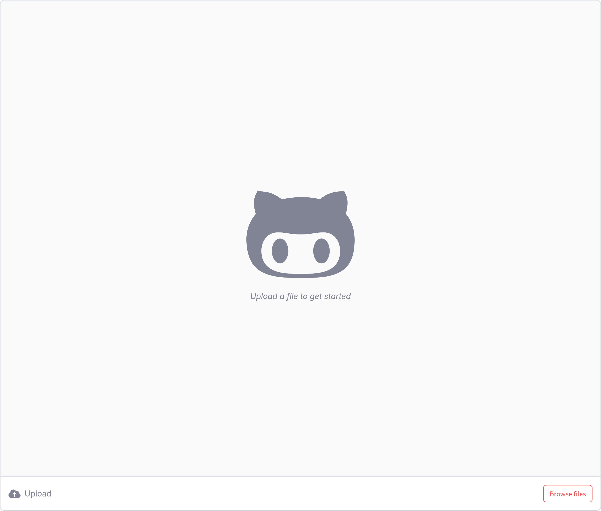

# codex :octocat:

Question Answering on PDF Documents



## About

This is a local web application that allows users to upload PDF documents and ask questions about the document to a voice assistant. The voice assistant will then answer the question based on the contents of the document.

## Setup

Here are the steps to run the application locally, on a Linux machine:

```bash
git clone git@github.com:kaangiray26/codex.git
cd codex
python3 -m venv .env
source .env/bin/activate
pip install --upgrade pip
pip install -r requirements.txt
```

## Usage

Before running the application, you need a `config.json` file in the root directory of the project. The file should contain the following keys:

```json
{
    "OPENAI_API_KEY": "<YOUR_OPENAI_API_KEY>",
    "DEEPGRAM_API_KEY": "<YOUR_DEEPGRAM_API_KEY>",
    "ELEVENLABS_API_KEY": "<YOUR_ELEVENLABS_API_KEY>",
    "DAILY_ROOM_URL": "<YOUR_DAILY_ROOM_URL>",
    "DAILY_API_KEY": "<YOUR_DAILY_API_KEY>"
}
```

Once you create the config file, you can run the application inside the virtual environment:

```bash
fastapi run
```

This will start the web server and the web application will be available at [localhost:8000/app](http://localhost:8000/app). Open the link in your browser to access the application.

Once the application is running, click on the "Upload" or "Browse files" button to upload a PDF document. This will spawn a bot in your browser that will start taking questions from you. You can ask questions by simply dictating them to the bot. Answers will be spoken back to you with subtitles and citations on the screen.

## Development

This project is built with **pipecat** and **LlamaIndex** mainly. Other components of this project include the [MarkItDown](https://github.com/microsoft/markitdown) library to convert PDF documents to markdown format real fast. The assistant uses several online services for STT, TTS and LLM inference. These services are listed as follows:

- [Deepgram](https://deepgram.com/) for STT
- [OpenAI](https://openai.com/) for LLM
- [ElevenLabs](https://elevenlabs.io/) for TTS

### Directory Structure

The root directory of the project contains the following directories and files:

```
├── dist                # Built web application
├── images              # Screenshots
├── lib                 # Python libraries
├── ui                  # Source code for the web application
├── .gitignore          # Git ignore file
├── LICENSE             # MIT License
├── main.py             # FastAPI main file
├── README.md           # Project README
└── requirements.txt    # Python dependencies
```

### Frontend

The web application uses Vue.js for the frontend, which is located in the `ui` directory. To serve it on the FastAPI server, the frontend is built and served as a static file with `vite`, which outputs the built files to the `dist` directory. The `dist` directory is then served by FastAPI at the `/app` endpoint.

### Workflow

The backend consists of many parts that build up a complex system. To explain how it works, let's go through the flow of the application:

1. The user uploads a PDF document to the web application.
2. The PDF content is handled by the backend, which saves the document content in the `uploads` directory like an object storage, and hashes the content to use it as an identifier. The document details are then saved in a SQLite database. If the document is uploaded for the first time, the backend converts the PDF to markdown format using the `MarkItDown` library. After the conversion, we feed the content to our index, which is built with `LlamaIndex` as a vector store index. The index is persisted in the `storage` directory, which will be created if it doesn't exist. These steps are handled as background tasks, so that the user doesn't have to wait for the process to finish.
3. Once the document upload is handled, the backend spawns a new process that creates a new boot in the room that we also create with the `Daily` API. The bot has access to the vector store index that we created in the previous step.
4. For each question asked by the user, the voice recording is first converted to text using the `Deepgram` API. The text is then fed to our LlamaIndexService, which uses a CitationQueryEngine to answer the question based on the document content. However, since the index may contain multiple documents, we first utilize a metadata filtering to restrict our answer to the document that the user uploaded. The answer is then passed to the `OpenAI` API to generate a more human-like response. The response is then passed to the `ElevenLabs` API to generate a voice response. The voice response is then played back to the user with subtitles on the screen.

Here is the pipecat pipeline described:

```
pipeline = Pipeline([
    self.transport.input(),              # Receives the user speech input
    self.stt_mute_filter,                # Mutes the STT when the bot is speaking
    self.rtvi_speaking,                  # Shows when a participant is speaking
    self.stt,                            # Converts the user speech to text
    self.rtvi_user_transcription,        # Sends the user transcription to the user
    self.context_aggregator.user(),      # Adds user message to the context
    self.llm,                            # Generates an answer to the user question
    self.rtvi_bot_transcription,         # Sends the LLM transcript to the user
    self.tts,                            # Converts the LLM answer to speech
    self.transport.output(),             # Directs the speech output to the user
    self.context_aggregator.assistant(), # Adds assistant message to the context
])
```

## Resources

- [pipecat](https://github.com/pipecat-ai/pipecat)
- [LlamaIndex](https://docs.llamaindex.ai/en/stable/)
